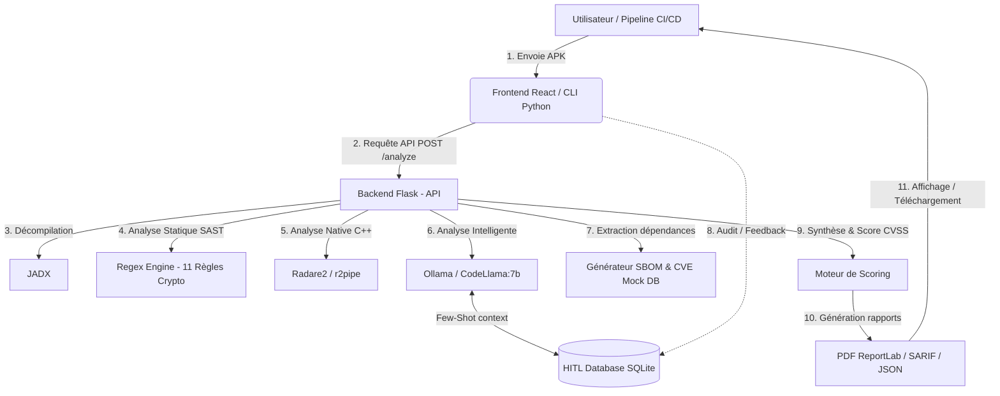

# 🛡️ SecurAPK — Outil d'Analyse Statique de Sécurité Mobile

[](https://opensource.org/licenses/MIT)
[](#prérequis)
[](#prérequis)
[](#prérequis)

**SecurAPK** est une plateforme professionnelle d'analyse statique de sécurité (SAST) pour les applications Android (APK). En combinant la décompilation de code, l'analyse par expressions régulières, l'intelligence artificielle locale, l'analyse de bibliothèques natives C++ et l'interaction humaine (Human-in-the-Loop), SecurAPK offre un audit complet de la sécurité de vos applications mobiles.

---

## 📝 Description Générale

SecurAPK est né de la nécessité de simplifier et d'approfondir l'audit de sécurité des applications mobiles Android. Face à l'évolution constante des menaces et à la complexité des configurations de sécurité, la plateforme propose une approche hybride et automatisée permettant de disséquer une APK sans l'exécuter.

La plateforme décompile l'APK cible pour en extraire son code Java et ses bibliothèques natives (`.so`). Elle applique ensuite une série de règles statiques prédéfinies basées sur les standards de l'OWASP MASVS (Mobile Application Security Verification Standard), tout en s'appuyant sur l'intelligence artificielle via un modèle **CodeLlama-7B** hébergé localement. L'IA évalue les fichiers sensibles et affine la détection grâce à des exemples Few-Shot tirés de retours d'auditeurs réels (système Human-in-the-Loop).

Enfin, l'analyse se prolonge dans le code natif grâce à l'outil de rétro-ingénierie **Radare2**, qui recherche les clés codées en dur et les appels de fonctions sensibles dans les binaires C++. L'ensemble des résultats est synthétisé sous forme d'un score de sécurité global et d'un rapport complet exportable en PDF ou au format SARIF pour une intégration directe dans vos pipelines de développement.

---

## 🚀 Fonctionnalités Principales

*   **🔍 Décompilation automatique** : Rétro-ingénierie rapide et complète de l'APK vers du code Java lisible à l'aide de **JADX**.
*   **🛡️ Analyse Statique (SAST) OWASP MASVS** : Détection des mauvaises pratiques cryptographiques courantes via 11 règles d'expressions régulières (MD5, SHA1, chiffrement AES/ECB faible, clés et vecteurs d'initialisation (IV) statiques codés en dur, stockage non sécurisé SharedPreferences, etc.).
*   **🤖 Audit assisté par Intelligence Artificielle (LLM)** : Analyse intelligente des fichiers sensibles à l'aide de **Ollama** avec le modèle **CodeLlama-7B** (sans envoi de données à des tiers).
*   **⚙️ Analyse du code natif (C++/.so)** : Analyse binaire poussée avec **Radare2** pour identifier les secrets enfouis, les clés hexadécimales en dur et les fonctions d'importation crypto douteuses.
*   **📦 Extraction SBOM (Software Bill of Materials)** : Inventaire automatique des librairies tierces utilisées par l'application et détection des vulnérabilités connues (CVE).
*   **👥 Audit Collaboratif Human-in-the-Loop (HITL)** : Possibilité pour un auditeur humain de classer les vulnérabilités trouvées par l'IA en Vrais Positifs (TP) ou Faux Positifs (FP). Les retours sont sauvegardés pour enrichir dynamiquement le contexte d'apprentissage Few-Shot du LLM.
*   **🎯 Score de sécurité global et Score CVSS** : Calcul d'une note de sécurité globale (sur 100) et notation par lettres (Grade A à F) selon l'impact CVSS estimé des failles trouvées.
*   **📊 Rapports d'exportation professionnels** : Téléchargement instantané de rapports d'analyse sous format PDF stylisé et rapports bruts en JSON.
*   **💻 Intégration CI/CD en ligne de commande (CLI)** : Script d'automatisation Python (`cli.py`) conçu pour s'intégrer dans vos pipelines de développement (ex: GitHub Actions), avec support des formats de rapports standardisés **SARIF** et arrêt du build en cas de dépassement d'un seuil critique (`--fail-on`).

---

## 📐 Architecture du Projet

SecurAPK repose sur une architecture moderne à deux composants principaux (Frontend / Backend) assistée par des outils tiers éprouvés.



### Description des Composants :
*   **Frontend (`/Frontend`)** : Interface monopage construite en **React** et **Vite** stylisée avec un design sombre premium moderne. Elle permet le téléversement intuitif d'une APK, la visualisation graphique des statistiques du scan, la navigation dans le code vulnérable et l'audit HITL direct.
*   **Backend (`/security_app`)** : Serveur REST en **Flask** qui orchestre le flux de traitement (sauvegarde, décompilation, exécution des différents moteurs d'analyse, et stockage de l'audit dans SQLite).
*   **CLI (`/security_app/cli.py`)** : Script Python autonome pour exécuter des analyses à distance ou intégrer SecurAPK dans des pipelines d'intégration continue (CI).

---

## 🛠️ Prérequis

Pour exécuter SecurAPK, assurez-vous d'avoir installé les outils suivants sur votre machine :

| Outil / Dépendance | Usage | Version Recommandée |
| :--- | :--- | :--- |
| **Python** | Langage d'exécution du Backend & du CLI | `3.10.x` ou supérieur |
| **Node.js & npm** | Environnement d'exécution et de build du Frontend | `Node v18+` / `npm v9+` |
| **Ollama** | Moteur d'exécution local du LLM (CodeLlama) | Dernière version stable |
| **JADX** | Décompilateur d'APK | `v1.4.x` ou supérieur (exécutable accessible via variable d'environnement ou chemin absolu) |
| **Radare2** | Analyseur de binaires natifs | `v6.x.x` (exécutable `r2.exe` sous Windows) |

---

## ⚙️ Installation et Configuration

### 1. Clonage du Projet
```bash
git clone https://github.com/Oumaymaa659/SecurAPK_ProjectSecurityMobile.git
cd SecurAPK_ProjectSecurityMobile
```

### 2. Configuration du Backend (`security_app`)
1. Rendez-vous dans le dossier backend :
   ```bash
   cd security_app
   ```
2. Installez les dépendances Python requises :
   ```bash
   pip install -r requirements.txt
   ```
   *(Note : les dépendances clés incluent `Flask`, `Flask-CORS`, `requests`, `reportlab`, et `r2pipe`).*
3. Configurez les chemins d'accès absolus dans les scripts si nécessaire :
   *   **JADX** dans `analyseur.py` : Modifiez la ligne `JADX_PATH = r"C:\jadx\bin\jadx.bat"` selon votre installation.
   *   **Radare2** dans `native_analyzer.py` : Modifiez la ligne `R2_PATH = r"C:\radare2\radare2-6.1.4-w64\bin\r2.exe"` selon votre installation.

### 3. Configuration d'Ollama et du LLM
1. Téléchargez et installez **Ollama** depuis le site officiel.
2. Lancez Ollama sur votre machine, puis téléchargez le modèle CodeLlama en ligne de commande :
   ```bash
   ollama pull codellama:7b
   ```
3. Assurez-vous qu'Ollama s'exécute en arrière-plan sur son port par défaut (`http://localhost:11434`).

### 4. Configuration du Frontend (`Frontend`)
1. Ouvrez un nouveau terminal et rendez-vous dans le dossier frontend :
   ```bash
   cd Frontend
   ```
2. Installez les modules Node.js requis :
   ```bash
   npm install
   ```

---

## 💻 Utilisation

Pour faire fonctionner SecurAPK dans sa totalité, vous devez lancer les serveurs Backend et Frontend simultanément.

### 1. Démarrer le Backend
Depuis le dossier `security_app` :
```bash
python app.py
```
Le serveur Flask démarrera à l'adresse suivante : `http://localhost:5000`.

### 2. Démarrer le Frontend
Depuis le dossier `Frontend` :
```bash
npm run dev
```
L'interface de démonstration sera accessible dans votre navigateur à l'adresse standard : `http://localhost:5173`.

### 3. Utiliser le CLI (CI/CD)
Le script CLI permet de valider une APK via un terminal.
```bash
cd security_app
python cli.py chemin/vers/votre_application.apk --fail-on 70 --sarif rapport.sarif
```
*   `--fail-on 70` : Le script retournera un code de sortie `1` (échec) si le score de sécurité de l'APK est inférieur à 70.
*   `--sarif rapport.sarif` : Génère un rapport normalisé SARIF à l'emplacement indiqué pour traitement automatisé (par exemple par des outils de sécurité de dépôt de code).

---

## 🎥 Vidéo de Démonstration

🎥 **Vidéo de démonstration** : [Lien vers la démo] *(à venir)*

---

## 📊 Résultats d'Exemple

Lorsqu'une APK est envoyée à SecurAPK, le backend effectue le cycle complet d'analyse et extrait les vulnérabilités de la façon suivante :

| Vulnérabilité Détectée | Gravité | Source | Règle / Emplacement | Description / Recommandation |
| :--- | :--- | :--- | :--- | :--- |
| **AES_ECB** | 🔴 Critique | Statique | `Cipher.getInstance("AES/ECB...")` | Le chiffrement ECB n'est pas sécurisé. Préférer `AES/GCM`. |
| **Cle_statique_dure** | 🔴 Critique | Statique | `secret = "d3b07384d113ed1a..."` | Clé secrète codée en dur. Stocker dans le `Android Keystore`. |
| **TrustManager_insecure**| 🔴 Critique | Statique | `checkServerTrusted()` vide | La validation SSL est désactivée. Risque majeur de MITM. |
| **Chaîne suspecte : private_key** | 🟡 Majeur | Native (`.so`)| `libs_natives/libsecure.so` | Clé privée suspectée dans le code natif. |
| **CVE-2022-25647** | 🟡 Majeur | SBOM | `com.google.gson` v2.8.6 | Mettre à jour la bibliothèque Gson vers la version 2.9.0. |
| **HostnameVerifier_all**| 🔴 Critique | IA | `HostnameVerifier` laxiste | Autorise la connexion à n'importe quel domaine hôte SSL. |

*Note : Les retours d'audit de l'utilisateur permettent de rejeter les fausses alertes (FP) afin d'améliorer la pertinence des résultats ultérieurs fournis par le modèle d'IA.*

---

## 🛠️ Technologies Utilisées

*   **Frontend** : [React](https://react.dev/), [Vite](https://vitejs.dev/), [Tailwind CSS](https://tailwindcss.com/)
*   **Backend** : [Python](https://www.python.org/), [Flask](https://flask.palletsprojects.com/), [SQLite](https://www.sqlite.org/)
*   **Analyse Statique & Rétro-ingénierie** : [JADX](https://github.com/skylot/jadx), [Radare2](https://www.radare.org/) (via `r2pipe`)
*   **Moteur IA** : [Ollama](https://ollama.com/) avec le modèle de code [CodeLlama](https://ollama.com/library/codellama)
*   **Génération PDF** : [ReportLab](https://www.reportlab.com/)

---

## 👥 Auteurs et Encadrement

*   **Auteurs** : 
    *   **Oumayma Benhilal** — Étudiante à l'EMSI
    *   **Riyad El Bouchikhi** — Étudiant à l'EMSI
*   **Encadrant** : **Mohamed Lachgar**
*   **Établissement** : **EMSI** (École Marocaine des Sciences de l'Ingénieur)

---

## 📄 Licence

Ce projet est sous licence **MIT**. Pour plus de détails, veuillez consulter le fichier [LICENSE](LICENSE) (ou le code source correspondant).